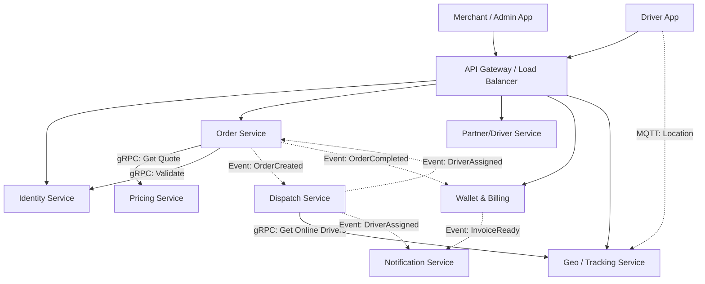

# QUDIL System Architecture & Microservice Design

## 1. Functional Scope

The QUDIL platform is a multi-tenant, on-demand logistics system serving Merchants, Customers, Delivery Agents, and Administrators.

| User Persona | Key Capabilities & Functionalities |
| :--- | :--- |
| **Merchant / Consignor** | • **Onboarding & KYC**: Registration, document upload, verification. • **Order Creation**: Single/Bulk order placement, scheduling. • **Pricing & wallet**: View rate cards, estimated costs, wallet recharge. • **Dashboard**: Live order tracking, history, automated reports. • **Settings**: Webhooks, API key management, multi-user access (stores). |
| **Delivery Agent** | • **Duty Management**: Shift start/stop, floating cash management. • **Order Fulfillment**: Accept/Reject requests, navigation, status updates (Arrived, Picked, Delivered). • **Proof of Delivery**: Signature, OTP, Photo upload. • **Earnings**: Daily earnings view, payout requests, incentives/penalties view. |
| **Admin / Operations** | • **Master Data Management**: Cities, zones, vehicle types, serviceability. • **User Management**: Merchant/Driver approvals, block/unblock. • **Dispatch Control Tower**: Manual override, live fleet map, heatmaps. • **Finance**: Payout processing, refund management, reconciliation. |
| **Finance & Settlement** | • **Invoicing**: GST-compliant invoices for merchants. • **Driver Payouts**: Automated settlement cycles (T+1, Weekly). • **Reconciliation**: Payment gateway vs. Order value vs. Driver wallet. |
| **Platform & Governance** | • **Tenant Management**: White-label configurations, feature flagging per tenant. • **Security**: OAuth2/JWT auth, RBAC, API rate limiting. • **Audit**: Activity logs for all sensitive actions. |

---

## 2. Module Breakdown

| Logical Module | Purpose | Owners |
| :--- | :--- | :--- |
| **Identity & Access** | Centralized authentication and authorization for all actors (Merchants, Drivers, Admin). Handles secure token generation. | Platform Security Team |
| **Tenant Manager** | Manages multi-tenancy configurations, themes, features, and domain mappings for white-label support. | Platform Team |
| **Core Operations** | Handles the core lifecycle of logistics: Prices, Quotes, Order state machine. | Ops Engineering |
| **Dispatch Engine** | The "Brain" of the system. Matches orders to drivers based on location, vehicle type, and allocation logic. | AI/Logistics Team |
| **Last Mile Execution** | Driver-side logic: Location streaming, battery tracking, app state, POD artifacts. | Mobile Ops Team |
| **Financials** | Manages money flow: Wallets, Credits, Payment Gateway integration, Invoicing. | FinTech Team |
| **Communications** | Abstracted notification layer for SMS, Email, Push, WhatsApp. | Platform Team |
| **Data & Insights** | Read-only replicas and pipelines for reporting, dashboards, and analytic streams. | Data Engineering |

---

## 3. Microservice Architecture

The system is decomposed into domain-driven microservices. All services are **Deployable Units** running on Kubernetes.

### 3.1 Identity Service (`auth-service`)
*   **Responsibilities**: User registration, Login (OAuth2/OIDC), Token issuance (JWT), Permission checks (ACL), KYC status key-holding.
*   **APIs Exposed**: `POST /login`, `POST /register`, `POST /introspect`, `GET /permissions`.
*   **Events Published**: `UserRegistered`, `UserBlocked`, `KYCSubmitted`.
*   **Database**: `db_identity` (PostgreSQL - Users, Roles Tables).
*   **Communication**: Sync (REST/GRPC) for Auth checks; Async for non-blocking updates.

### 3.2 Tenant Service (`tenant-service`)
*   **Responsibilities**: Store configurations for B2B clients (branding, features enabled), API Key management for merchants.
*   **APIs Exposed**: `GET /config/{tenantId}`, `POST /features/toggle`.
*   **Events Published**: `TenantConfigUpdated`.
*   **Database**: `db_tenant` (PostgreSQL - Configs, APIKeys).
*   **Cache**: Redis (High heavy read for configs).

### 3.3 Pricing & Quotation Service (`pricing-service`)
*   **Responsibilities**: Calculate shipping costs based on distance, weight, vehicle type, surge pricing, and tenant contracts.
*   **APIs Exposed**: `POST /quote`, `GET /rate-card`.
*   **Events Published**: `QuoteGenerated`.
*   **Database**: `db_pricing` (PostgreSQL + PostGIS for zones).
*   **Logic**: Pure function application (stateless mostly), heavily cached rules.

### 3.4 Order Management Service (`order-service`)
*   **Responsibilities**: Order lifecycle (Created -> Assigned -> Picked -> Delivered), Validation, State machine restrictions.
*   **APIs Exposed**: `POST /orders`, `GET /orders/{id}`, `PATCH /orders/{id}/cancel`.
*   **Events Published**: `OrderCreated`, `OrderCanceled`, `OrderCompleted`.
*   **Database**: `db_oms` (PostgreSQL - High write).
*   **Dependencies**: Calls `pricing-service` for final validation.

### 3.5 Dispatch & Matching Service (`dispatch-service`)
*   **Responsibilities**: Auto-allocation algorithms, Driver search, Batching, Route optimization.
*   **APIs Exposed**: `POST /dispatch/assign`, `POST /dispatch/reject`, `GET /driver-queue`.
*   **Events Published**: `DriverAssigned`, `AllocationFailed`, `SearchStarted`.
*   **Database**: `db_dispatch` (NoSQL/Mongo for transient assignment logs).
*   **In-Memory**: Redis Geospatial for "Nearby Drivers" queries.

### 3.6 Live Tracking & Geo Service (`geo-service`)
*   **Responsibilities**: Ingest driver heartbeats (MQTT/WebSocket), Geofencing, ETA calculation, History playback.
*   **APIs Exposed**: `WS /stream/location`, `GET /tracking/{orderId}`.
*   **Events Published**: `DriverArrivedAtPickup`, `DriverEnteredZone`.
*   **Database**: `db_geo` (Cassandra/TimeScaleDB for location history).
*   **Cache**: Redis for "Current Last Known Location".

### 3.7 Driver Partner Service (`partner-service`)
*   **Responsibilities**: Driver profiles, Vehicle details, Shift capability (On/Off duty), Performance scoring.
*   **APIs Exposed**: `POST /duty/toggle`, `GET /profile`.
*   **Events Published**: `DriverDutyChanged`, `DriverVerified`.
*   **Database**: `db_partner` (PostgreSQL).

### 3.8 Proof of Delivery (POD) Service (`pod-service`)
*   **Responsibilities**: Secure storage of delivery signatures, photos, and OTP validation.
*   **APIs Exposed**: `POST /upload-pod`, `POST /verify-otp`.
*   **Events Published**: `PodUploaded`, `DeliveryVerified`.
*   **Database**: `db_pod` (PostgreSQL metadata + S3/Blob Storage).

### 3.9 Wallet & Invoice Service (`billing-service`)
*   **Responsibilities**: Merchant credits, Pre/Post-paid billing, Driver floating cash limits, Invoicing, Tax calculation.
*   **APIs Exposed**: `POST /wallet/recharge`, `GET /invoice/{id}`.
*   **Events Published**: `WalletDeducted`, `InvoiceGenerated`, `LowBalanceAlert`.
*   **Database**: `db_billing` (PostgreSQL - ACID compliant strictly).

### 3.10 Notification Service (`notify-service`)
*   **Responsibilities**: Template management, Routing to providers (Twilio/SendGrid/FCM), DLQ handling.
*   **APIs Exposed**: Internal GRPC only.
*   **Events Consumed**: `OrderCreated`, `DriverAssigned`, etc.
*   **Database**: `db_notify` (MongoDB for logs).

### 3.11 Report & Analytics Service (`analytics-service`)
*   **Responsibilities**: Aggregating data for dashboards, MIS generation.
*   **APIs Exposed**: `GET /stats/orders`, `GET /reports/download`.
*   **Database**: `db_analytics` (ClickHouse/Redshift/BigQuery).
*   **Behavior**: Async consumer of ALL domain events.

---

## 4. Event Catalogue

The system follows an **Event-Carried State Transfer** pattern where possible.

| Event Name | Producer | Consumer(s) | Payload (Key Fields) |
| :--- | :--- | :--- | :--- |
| `OrderCreated` | Order Service | Dispatch, Billing, Notify, Analytics | `orderId`, `pickup`, `drop`, `tenantId` |
| `SearchStarted` | Dispatch Service | Geo Service | `orderId`, `searchRadius`, `vehicleType` |
| `DriverDutyChanged` | Partner Service | Dispatch, Geo | `driverId`, `status` (ON/OFF), `location` |
| `AllocationSuccess` | Dispatch Service | Order, Notify, DriverApp | `orderId`, `driverId` |
| `DriverLocationUpdate` | Driver App | Geo Service, Dispatch | `driverId`, `lat`, `long`, `speed` |
| `OrderPickedUp` | Driver App | Order, Notify | `orderId`, `timestamp` |
| `DeliveryVerified` | POD Service | Order, Billing | `orderId`, `proofUrl` |
| `OrderCompleted` | Order Service | Billing, Partner, Notify | `orderId`, `finalAmount` |
| `WalletDeducted` | Billing Service | Order, Notify | `userId`, `newBalance` |

---

## 5. Service Dependency Diagram (Textual)

---

## 6. Non-Functional Requirements (NFR)

### **Scalability (10x Growth)**
*   **Stateless Services**: All microservices (Order, Pricing, Auth) are stateless and horizontally autoscaled using K8s HPA based on CPU/Memory and Queue Depth.
*   **Database Sharding**: `db_oms` and `db_geo` are sharded by `TenantID` or `CityID` to handle high throughput.
*   **Read Replicas**: All Postgres DBs use Read Replicas for `GET` operations.

### **Fault Tolerance**
*   **Circuit Breakers**: Implemented on all synchronous gRPC calls (e.g., Order -> Pricing).
*   **Dead Letter Queues (DLQ)**: Failed events in Kafka/RabbitMQ are moved to DLQ for manual replay, ensuring no data loss.
*   **Graceful Degradation**: If `GeoService` is down, Order creation is still allowed (address-based validation only).

### **Data Isolation (Multi-Tenancy)**
*   **Logical Isolation**: All DB queries strictly force `WHERE tenant_id = ?`.
*   **Schema Isolation**: (Optional for high-value enterprise tiers) Separate schemas per tenant for compliance.

### **Security**
*   **Encryption**: TLS 1.3 in transit. AES-256 for PII (Phone numbers, addresses) at rest.
*   **RBAC**: Fine-grained scopes in JWT (e.g., `order:create`, `report:view`).

### **Observability**
*   **Distributed Tracing**: OpenTelemetry integrated. `TraceID` propagated across API -> Kafka -> Consumer.
*   **Metrics**: Prometheus scraping (`http_requests_total`, `active_drivers`).
*   **Logs**: JSON structured logs shipped to ELK/Loki stack.

---

## 7. Architecture Rules (Inviolable)

1.  **Database Ownership**: Service A **never** connects to Service B's database. It must call Service B's API.
2.  **Async First**: Critical path (Booking) is Sync. Everything else (Email, Reporting, Wallet Credit) is Async via Events.
3.  **Real-Time State**: Driver locations and Assignment status live in **Redis**, not Postgres.
4.  **No Business Logic in CDN/Gateway**: Gateway only handles SSL, Auth verification, and Routing.
5.  **Strict Reporting Separation**: Analytics service reads from Events or Read-Replicas, **never** the master OLTP DB.
